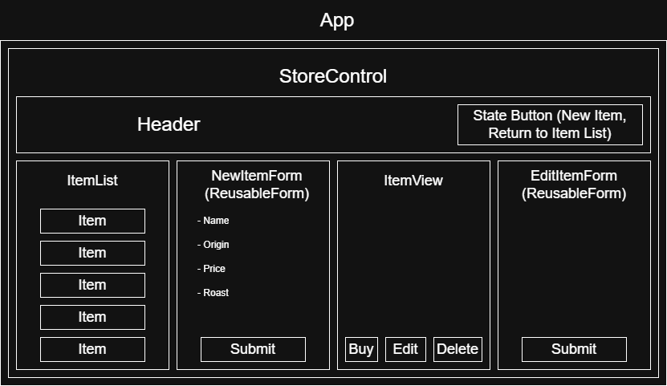

# Inventory Tracker

#### _Inventory tracker for a hypothetical coffee shop._

#### By _**India Lyon-Myrick**_

## Technologies Used

* _Javascript_
* _HTML_
* _CSS_
* _Bootstrap_
* _Webpack_
* _Node.js_
* _React.js_
* _Git_

## Description

_An inventory tracker for a coffee store / bean manufacturer. The website is a single-page application, which opens to a list of items. Items can be added to the shop from a form component, and once items have been added, they can be viewed by clicking anywhere on the item component. From an item's details page, the item can be purchased, as well as edited or deleted. Once an item's stock reaches zero, the item can not be purchased further and it will be labelled as out of stock._

_Diagram of planned site:_

_[Background image from Pixabay](https://pixabay.com/photos/coffee-coffee-beans-beans-roasted-3392168/)_

## Setup/Installation Requirements

* _You will need Node.js (`https://nodejs.org/en/download/current`) to run the program._

_1: Clone the repository to a folder of choice on your machine (by either using the "Code" button on the GitHub page, or in a terminal application using `git clone https://github.com/igl-myrick/inventory-tracker`)._

_2: Using a terminal application such as Git Bash or Windows Command Prompt, navigate to the top level of the program folder and run `npm install`. This may take some time._

_3: Next, run `npm run build` to build the program._

_4: Once the program is built, run `npm run start` to open and use the program._

## Known Bugs

* _None at the moment._

## License

_[MIT](/LICENSE.md)_